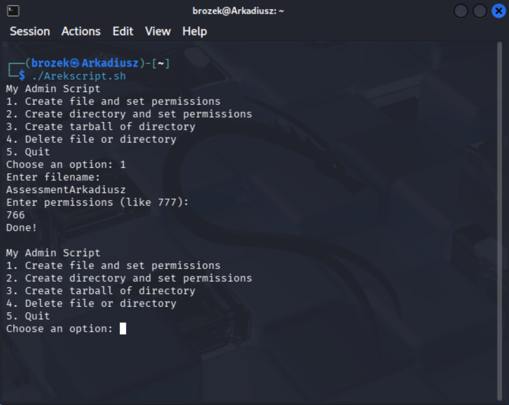
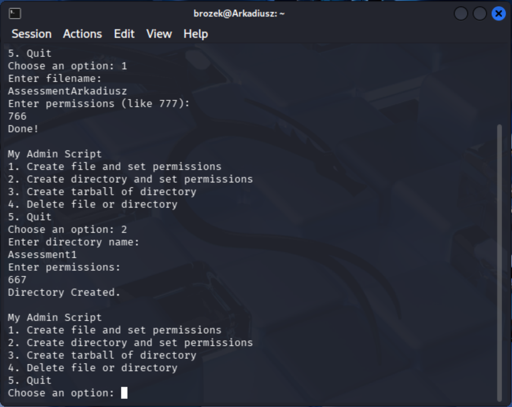
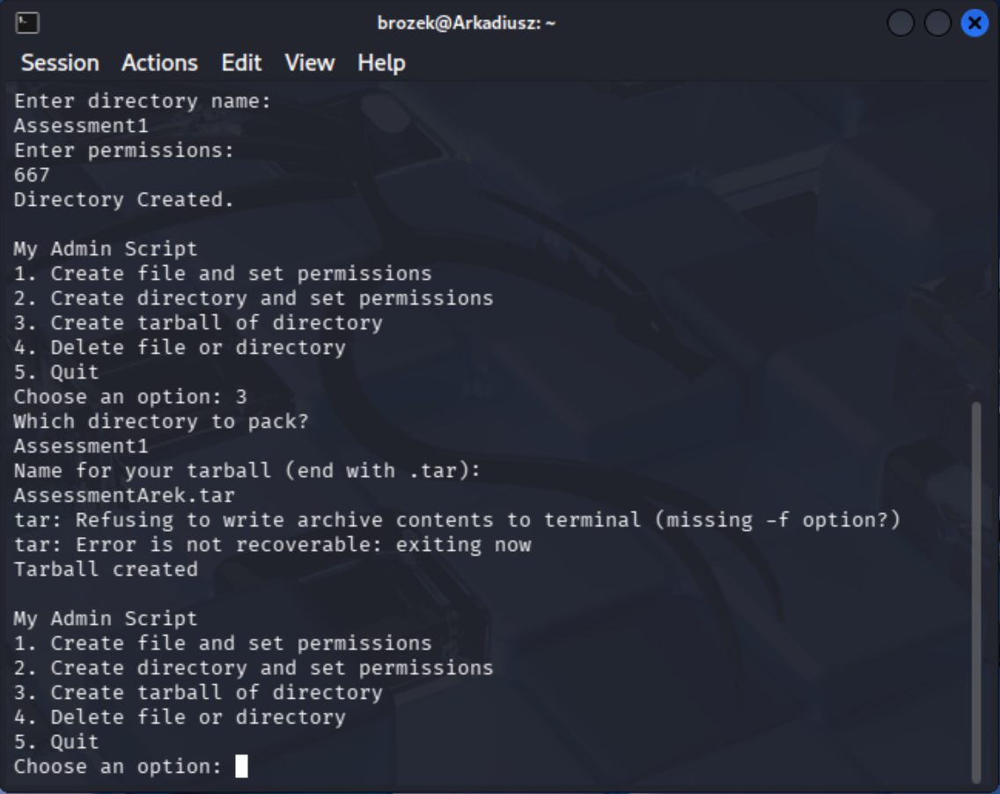
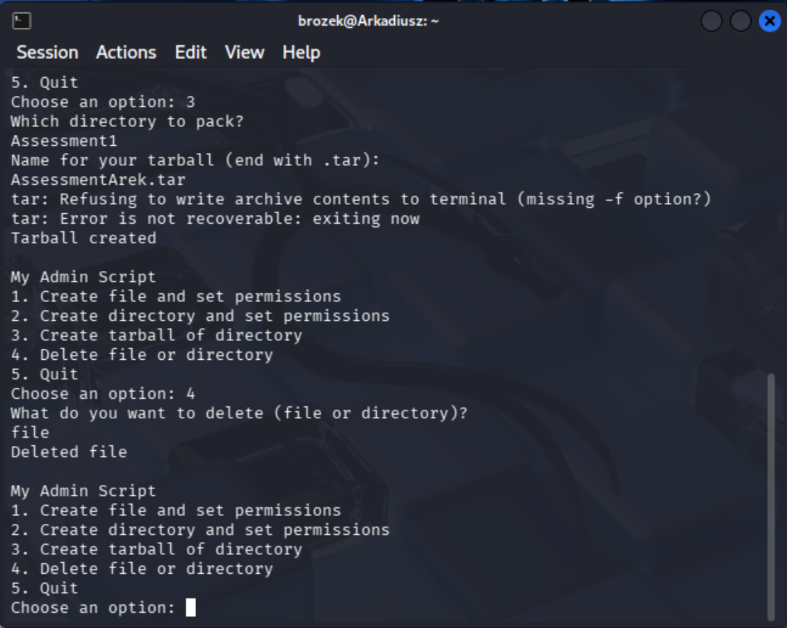
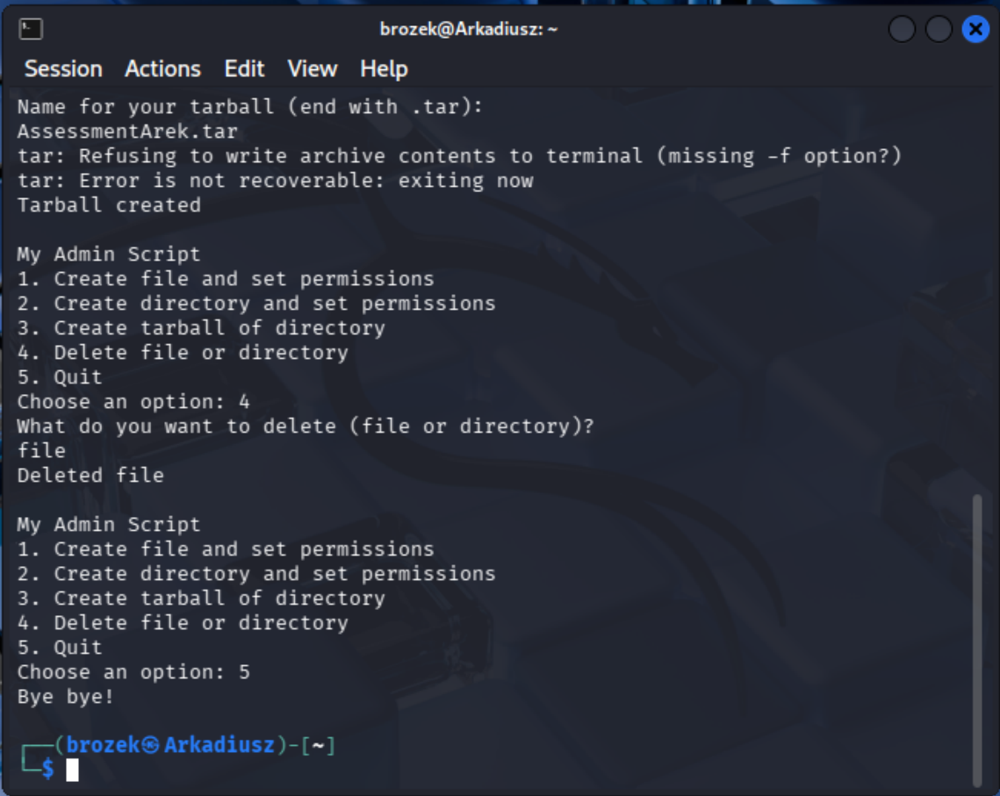

# Linux Admin Automation Utility

## Project Overview
This project features a robust Bash script designed for automating daily Linux system administration tasks. Developed as part of an HNC Cyber Security assessment, it demonstrates core shell scripting practices, user input handling, and secure file/directory management within a Linux environment.

## Key Features
* **Interactive Menu:** Keeps running continuously using a `while` loop until explicitly terminated by the user.
* **File & Directory Management:** Streamlines the creation of files and directories alongside immediate permission assignment using `chmod`.
* **Archiving Capabilities:** Automates directory backup processes by generating standardized `.tar` tarballs.
* **Efficient Cleanup:** Includes a unified removal function using `rm -rf` to delete specified files or direcory structures.

## How to Run
1. Clone this repository to your local Linux machine.
2. Grant execution privileges to th script:
    ```bash
    chmod +x Arekscript.sh
    ```
3. Execute the utility:
    ```bash
    ./Arekscript.sh
    ```

## Functional Verification

### 1. Create File and Set Permissions
Verification of file creation and automated chmod permission assignment.



### 2. Create Directory and Set Permissions
Verification of directory creation and custom permission application.



### 3. Create Tarball of Directory
Verification of automated backup generation using tar compression utility.



### 4. Delete File or Directory
Verification of the automated recursive cleanup process using rm utility.



### 5. Exit Script
Verification of the clean environment exit sequence.

